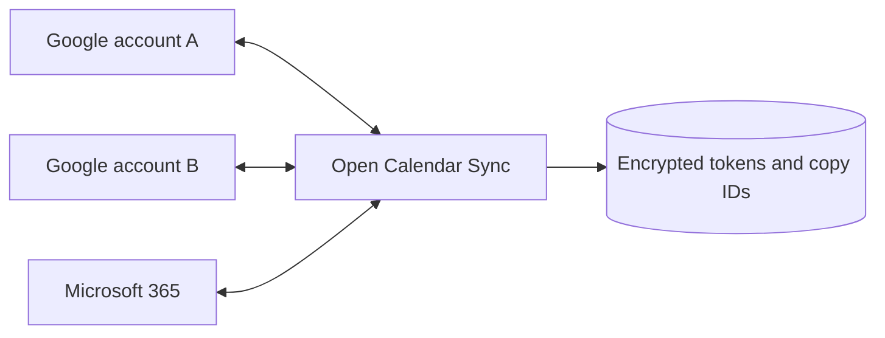

# Open Calendar Sync

**Free, self-hosted busy-time sync for Google Calendar and Microsoft 365.**

Connect your work and personal accounts, select the calendars to include, preview the busy blocks, and start automatic syncing. A meeting in one selected calendar creates a private **Busy** block in the others. No subscriptions or per-calendar limits in the software.

Built by [AlanOps](https://alanops.com). MIT licensed.

> **v0.1 — self-hosted preview.** This is a working server and dashboard, not a hosted calendar service. You supply your own Google and Microsoft OAuth app registrations and run one instance for one person's accounts. Automated tests use simulated provider responses; live Google/Microsoft account consent and end-to-end provider validation are still required before relying on it for scheduling.

## What it does

- Syncs the **primary calendar** of any number of connected Google and Microsoft accounts, in all directions.
- Checks every five minutes while the server runs, including when your browser is closed.
- Copies only busy times as private blocks with no guests, notifications, descriptions, locations or meeting links.
- Handles expanded recurring occurrences, moved events, cancellations, all-day dates and timed-event offsets.
- Skips free/declined events and app-created copies. Avoids duplicate invitation copies when provider meeting IDs and occurrence times match.
- Reconciles a rolling window: the previous seven days and the next 90 days by default.
- Never edits or deletes original events. Cleanup targets only tracked copies with this installation's ownership marker.
- Stores provider tokens encrypted at rest, with a private dashboard protected by an access key and session cookies.
- Offers a read-only preview, pause/resume, recent activity and account disconnection with managed-copy cleanup.

## Quick start (Linux, macOS or WSL)

Requires Python 3.12 or later. Windows users can run the Linux container or WSL.

```bash
git clone https://github.com/alanops/open-calendar-sync.git
cd open-calendar-sync
python3 -m venv .venv
source .venv/bin/activate
pip install -r requirements.lock
pip install --no-deps -e .
python -m calendar_sync.setup
uvicorn calendar_sync.app:create_app --factory --host 127.0.0.1 --port 8000 --no-access-log
```

Open [localhost:8000](http://localhost:8000). Sign in using the `ADMIN_TOKEN` generated in `.env`. The dashboard works before provider setup and explains which connections still need credentials. **Sync begins paused.**

Next, follow the [Google and Microsoft setup guide](docs/oauth-setup.md), add the credentials to `.env`, and restart. Connect each account separately, select its **Sync** checkbox, preview, then start automatic sync.

For Docker and an HTTPS domain such as `calendar.alanops.com`, see [Self-hosting](docs/self-hosting.md). Hosting and any provider/infrastructure charges are separate from this free software. GitHub Pages cannot run the sync server.

## How it works



Each cycle fully reads all selected calendars before writing. It computes the desired private busy blocks, creates or updates copies, then cleans up obsolete copies. A failed snapshot prevents all writes for that cycle. Failed writes prevent subsequent cleanup; successful earlier writes are recovered on the next cycle.

Google copies use private extended properties and client-generated event IDs. Microsoft copies use named extended properties and transaction IDs. Creation intent is persisted before sending the request, allowing a retry to find a successful write whose response was lost. Conditional requests use event versions where supplied by the provider. App-created copies never become source events, so the calendars do not bounce copies around forever.

## Boundaries

- **One owner per instance.** Anyone with the dashboard key can manage every connected account. This is not a public multi-user SaaS; do not give unrelated users access to the same instance.
- **Primary calendars only** in this version. Shared, resource and secondary calendars are not selectable yet.
- **Busy-time replication**, not full meeting editing. Edit the original meeting to move or cancel it. A manually deleted busy copy will be recreated if its source still exists.
- Keep one active sync engine for these calendars. Other sync products may create copies with different markers and cause duplication.
- Sync is polling, not instant. API throttling, lost permissions and downtime can delay updates. A pause leaves existing copies in place.
- Copies outside the rolling window are removed on successful cycles, including historical copies older than seven days. Originals are retained.
- Disconnect pauses syncing and removes **all copies made by this installation** across connected accounts before forgetting the chosen account's token. Resume to rebuild for the remaining accounts. If cleanup fails, credentials are retained so you can reconnect/retry. Provider grants can be revoked separately in Google/Microsoft account settings.
- Google consent in external **Testing** mode can cause refresh tokens to expire after seven days. A shared public service requires provider verification and a multi-user security design; publishing this repository does not complete those steps.
- Keep the database **and its encryption key** together when backing up. Losing either can orphan copies. Do not run a second instance against the same calendars or restore stale backups without reconciling existing copies.

Read [Security and privacy](SECURITY.md) and [Architecture](docs/architecture.md) for operational details.

## Development

```bash
pip install -e '.[dev]'
pytest -q
ruff check .
ruff format --check .
node --check calendar_sync/static/app.js
```

Tests cover provider request contracts, pagination failures, OAuth state/PKCE, session protection, all-day dates, time-zone equivalence, recurrence, idempotency, interrupted writes, deletion guards and cleanup. CI runs on Python 3.12 and 3.13 and builds the container.

No production account data or credentials are included. Contributions and bug reports are welcome; use synthetic calendar events in reports.
